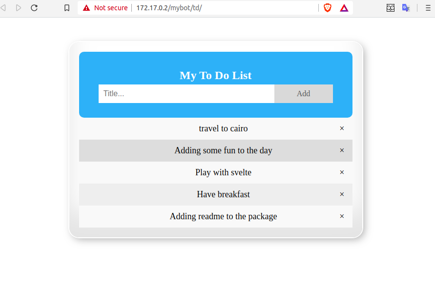
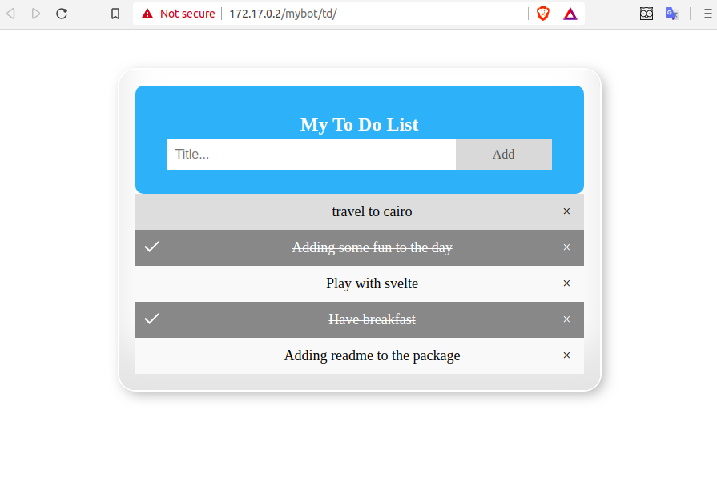
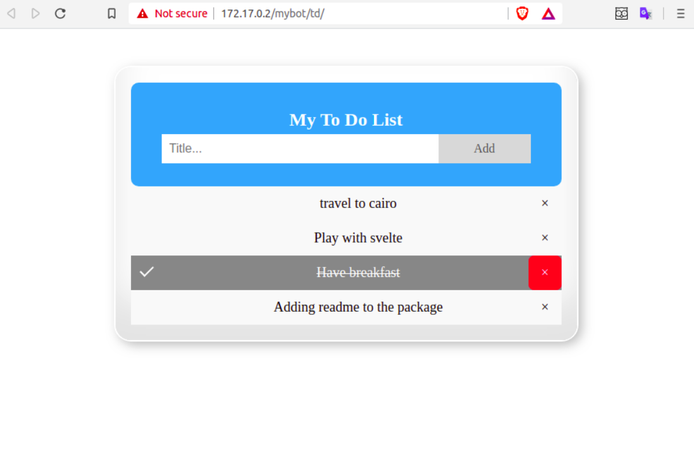

# TODO-tasks








### Install

- ```
  j.servers.threebot.start()

  j.threebot.packages.zerobot.packagemanager.actors.package_manager.package_add(path='/sandbox/code/github/threefoldtech/jumpscaleX_threebot/ThreeBotPackages/examples/td')
  ```
### Start
    then you can start from packege maneger or from shell with commend:
- ```
  p.mybot.td.install()
  p.mybot.td.start()
  ```

- use URL `http://<host>/mybot/td`.
